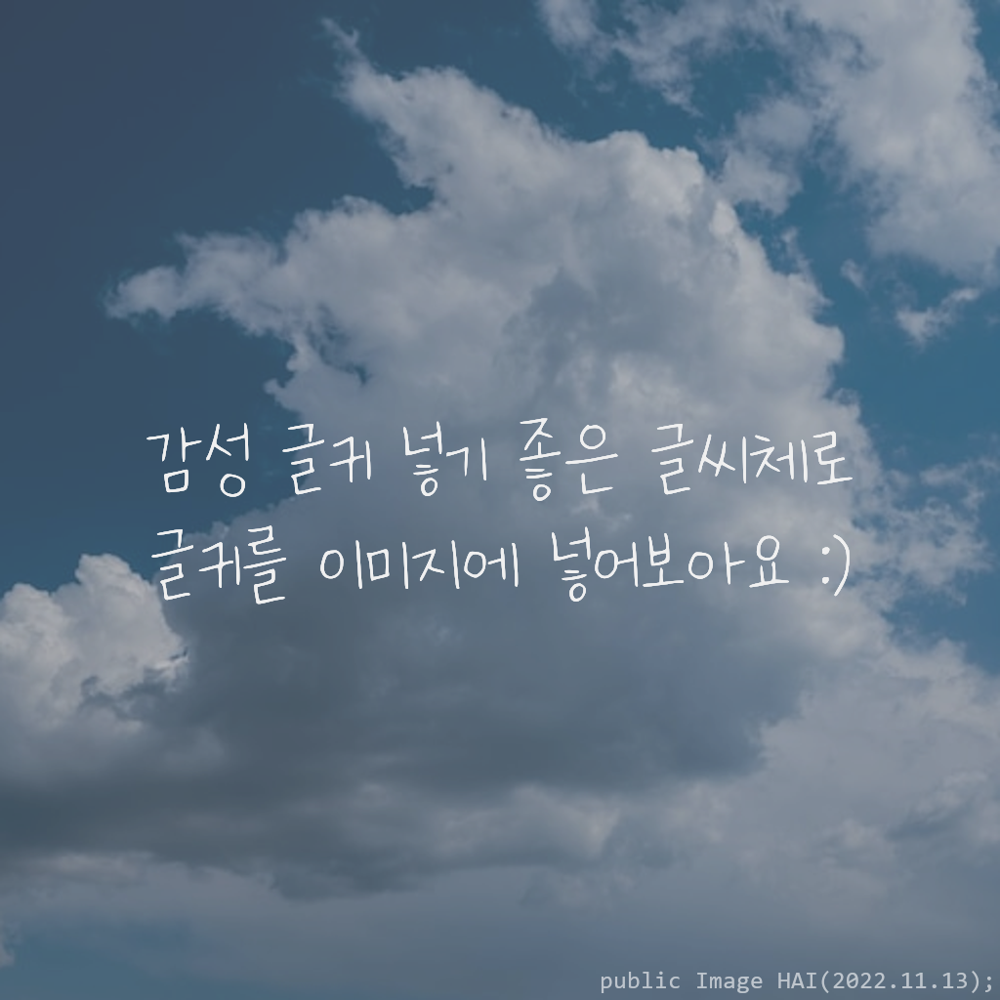
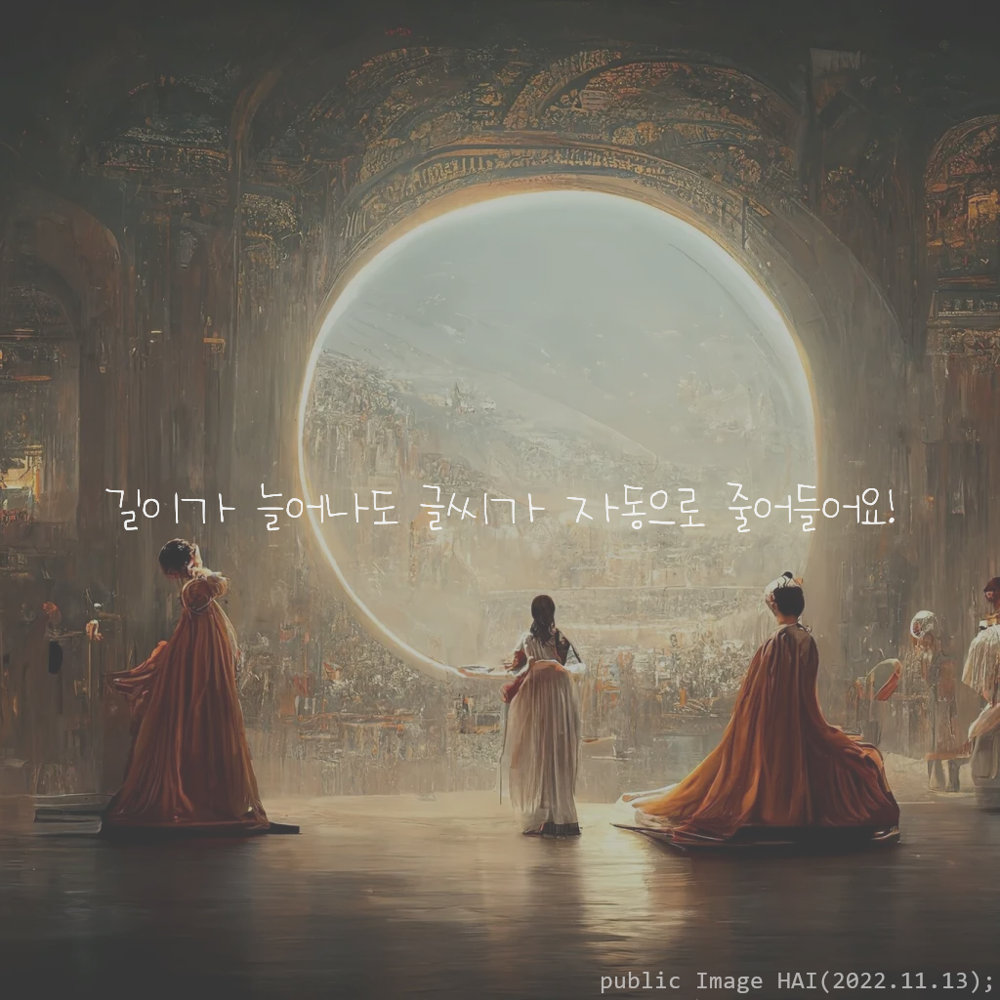

# text image merger 🖼️

 ---

> 이미지에 텍스트를 감성문구처럼 넣어보아요!



main.py에 예제 코드를 넣었습니다. 😊
<br>ImageManager를 옮겨서 사용할 수 있습니다

## 주요 코드

#### ImageManager() 생성자
```python
ImageManager(self,
         fonts=None, font_list_tag: str = "None",
         img_path: str = '', img: Image = None,
         text: str = '')
``` 
그림 설정
* img_path="이미지의 절대주소" 또는 Image="pil 이미지 값 (PIL.Image)" 을 이용하여 이미지를 불러올 수 있습니다.   

폰트 설정
* fonts=리스트, font_list_tag=태그 이름(기본은 'None') 또는
<br> fonts=딕셔너리({'폰트절대주소' : '태그값'}) 으로 폰트를 불러올 수 있습니다.   

텍스트 설정
* text='텍스트' 를 통하여 텍스트를 넣을 수 있습니다. 나중에 넣어도 되는 설정입니다   
자동 줄바꿈이 되지 않아 줄바꿈시 '\n' 을 넣어주어야 합니다.   

#### set_text()
```python
ImageManager.set_text(texts: str = '')
```
현재 있는 텍스트를 버리고 texts로 바꾸어줍니다.    

#### resize_image()
```python
ImageManager.resize_image(size=(1024,1024))
```
그림의 크기를 조절합니다 (기본은 1024x1024)

#### add_text_in_middle
```python
ImageManager.add_text_in_middle(auto_font_color : bool = False)
```
그림에 넣어질 텍스트를 중앙에 배치되게 합니다.
auto_font_color를 통해 그림에 따른 색상을 자동으로 정해주게 합니다. (기본값: 흰색)

#### add_watermark()
```python
ImageManager.add_watermark(font_path: str)
```
폰트(절대 주소)에 따른 워터마크를 생성합니다.

#### add_color_img()
```python
ImageManager.add_color_img(color: tuple[int, int, int, int] = (0, 0, 0, 80))
```
그림에 불투명한 색 효과를 집어넣습니다. (기본값: 검은색)

#### merge_img()
```python
ImageMan.merge_img(text_add_time: int = 1)
ImageMan.merge_img(text_add_time: int = 1).show() # 이미지를 보여줍니다.
```
이미지를 보여줍니다